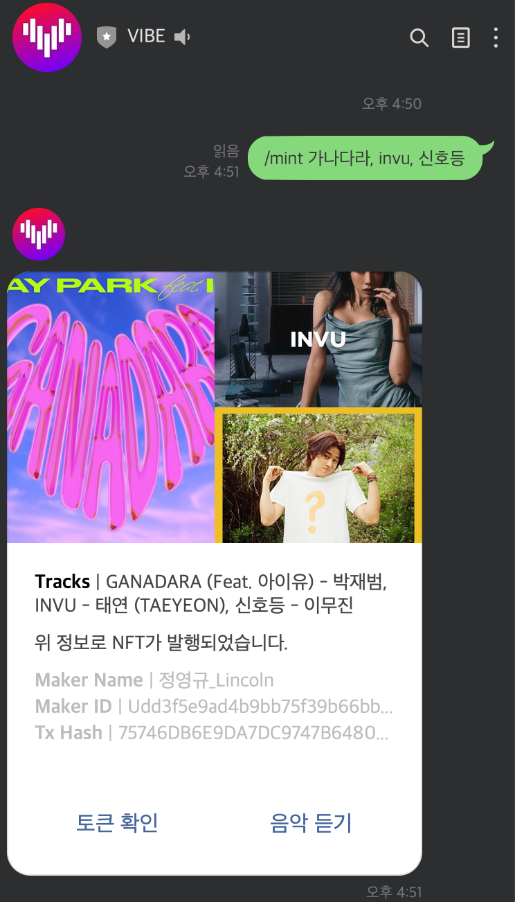
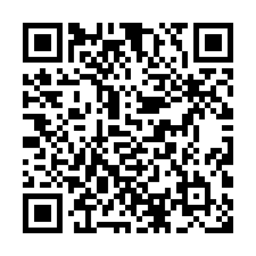

# VIBE NFT
- Contact: `lincoln.jeong@gmail.com`

## Purpose
- VIBE의 새로운 NFT 실험 및 제안
- [](img/screen.png)

## How to use
1. `@471wisct` 또는 아래 `QR Code`로 LINE 친구 등록
   - 아이디로 추가시 반드시 '@' 포함
   - [](img/471wisct.png)
2. `/mint 트랙1, 트랙2, 트랙3` 형식으로 명령어 입력
   - 트랙이 여러개인 경우 반드시 ,(comma)로 분리되어 입력해야 함
   - 정확한 검색을 위해서는 트랙명과 함께 아티스트 명을 적어주는 것이 좋음(예: `/mint 신호등 이무진, 톰보이 아이들`)
   - 마땅한 트랙을 찾지 못한 경우 토큰에서 누락될 수 있음
3. VIBE NFT message를 통해 `토큰 확인` 또는 `VIBE에서 음악 듣기` 가능
4. 토큰 확인 시 LINE의 `Blockchain Explorer`로 이동하여 조회됨
   - 테스트 환경(`Cashew Net`)의 한계로 특정 월렛으로 전송하기 위해서는 `테스트 아이디` 등록이 필요하여 임시로 `Lincoln`의 월렛으로 생성된 NFT가 입고되도록 하였음
   - 본인의 LINE Wallet(`LINE Bitmax`)으로 NFT 전송을 희망하는 경우 `Lincoln`에게 `테스트 아이디` 등록 문의
   - 생성된 NFT는 실제 LINE Blockchain Network(`Cashew Net`)에 기록되어 누구나 열람 가능한 상태이므로 보안을 요하는 테스트인 경우 주의 필요 (생성된 NFT의 Burn을 원하는 경우 `Lincoln`에게 문의)

## Prerequisite

- Python 3.x
- Docker

## Development

```
pip install -r requirements.txt
bash run.sh
```

#### Or

```shell
docker-compose up
```

```shell
curl http://localhost:5000/
```

## LICENSE

MIT
